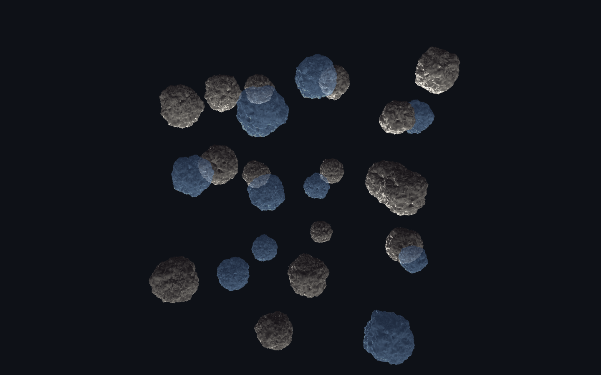
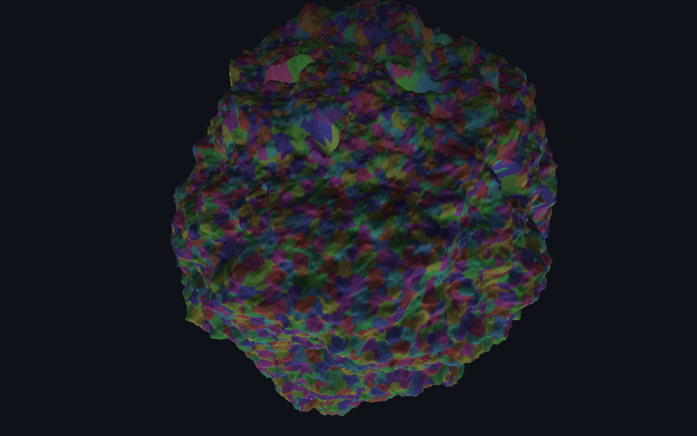
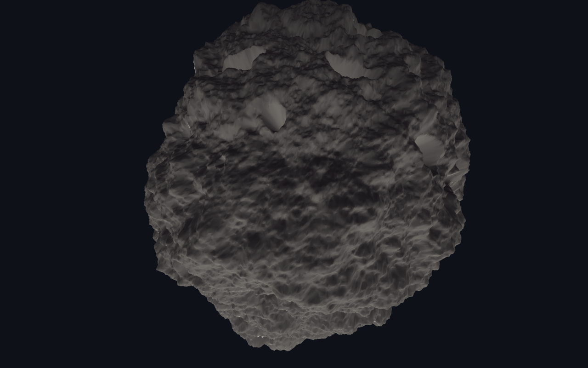
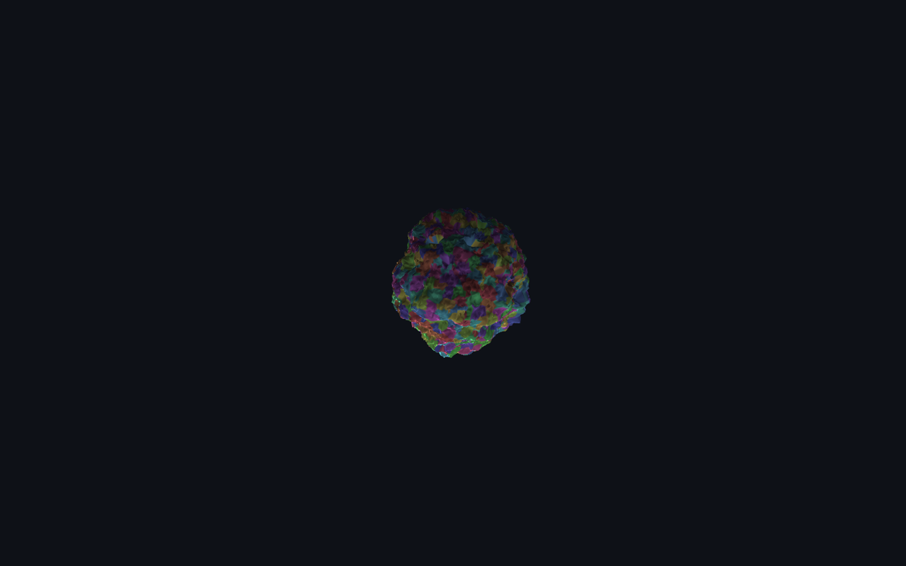

# Tessera

Streaming cluster LOD for the browser, inspired by Unreal's Nanite. A *tessera* is one tile of a mosaic; here every tile is a cluster of up to 128 triangles, and the mosaic re-tiles itself as the camera moves. A 1.5-million-triangle model is cut into 35,000 clusters arranged in a 13-level hierarchy, streamed as six archives, and rendered by Babylon.js from a cut that a Rust/WebAssembly runtime re-selects every frame. The first frame shows up after the first 0.5 MB; the rest refines in place.

**Live demo:** https://d1i.github.io/tessera/



The demo opens on the benchmark scene: 27 instances of the model (40.5 million source triangles, a third of them translucent) and a switch that turns Tessera off, so the same scene, camera and draw calls can be compared against drawing the full geometry.

## What it does

- **Cluster hierarchy, not discrete LODs.** The mesh is split into meshlets (≤128 triangles). Neighbouring clusters are grouped by eight, each group is simplified to half its triangles with the group border locked, and the result is re-clustered. Repeat until one cluster is left. Groups overlap differently on every level, so no seam survives from one level to the next and the cut never shows cracks.
- **Per-cluster error metric.** Every cluster carries the error of the simplification that produced it and the error of the coarser cluster that will replace it. The runtime projects both to screen pixels and renders a cluster exactly when its own error is under the threshold and its replacement's is over. Errors are monotonic up the hierarchy and parent bounds enclose child bounds, so the decision is made independently per cluster and still yields one consistent cut.
- **Streaming with a proxy first.** Archives are ordered coarse to fine. The first one (0.5 MB of a 26 MB model) holds the top eight levels, which is enough for a complete picture. All six are fetched in parallel over HTTP/2 and decoded in order; clusters whose finer children have not arrived yet simply stay in the cut.
- **One vertex pool, one draw call.** Vertex buffers for the whole model are allocated once from the manifest and filled range by range as archives decode. The cut is a list of index ranges copied into one index buffer, so the whole model is a single draw call regardless of how many clusters are visible.
- **Rust → WebAssembly runtime** for decoding (quantized positions, octahedral normals, 8-bit local indices) and for the per-frame selection, with a TypeScript port of the same algorithm kept as the reference implementation and as the benchmark baseline. The viewer runs on whichever is available and shows which one it is.
- **Instances share the pool.** Every instance of the model is a mesh over the same vertex buffers with an index buffer of its own; the runtime selects each instance's cut for the camera in that instance's object space (uniform scale cancels out of the error projection). Selection is amortised over frames with a per-frame budget, and a still camera selects nothing.

## Benchmark: Tessera on vs off

The switch at the top of the panel turns the technique off. Off means what a renderer without cluster LOD does: every instance draws the full-resolution geometry from one shared index buffer, no selection, no culling, same meshes, same materials, same draw calls. The default scene is deliberately heavy: 27 instances × 1,498,176 triangles = 40,450,752 source triangles, with a third of the instances translucent (alpha blending behind a depth pre-pass, so both passes scale with the triangle count). At the opening view the cut is 337k triangles, 120× fewer than the full geometry; the scene can be set to 1, 9, 27 or 64 instances (64 is 96 million source triangles).

**Run A/B benchmark** measures the current camera in both modes, 2.5 s each after every instance's cut is current, and prints the GPU, the frame rate, the milliseconds per frame, the triangles per frame and the cost of re-selecting every instance's cut:

```
ANGLE (NVIDIA, NVIDIA GeForce RTX 3060 ...)
1920×1080 · 27 × 1,498,176 = 40,450,752 source triangles · wasm runtime
Tessera on    …  fps ·   … ms/frame ·     337,464 tris/frame · cut for 27 instances in … ms
Tessera off   …  fps ·   … ms/frame ·  40,450,752 tris/frame
→ …× the frame rate with 120× fewer triangles
```

The numbers depend on the GPU, so the demo prints them rather than this README claiming them. The off figure is bounded by raw triangle throughput (and by fill for the translucent instances); the on figure by the pixels on screen.



## Bring your own model

Drop an `.obj`, `.stl`, `.glb` or `.gltf` onto the page (or use **Load your model…** in the panel). The same hierarchy builder runs in the browser, in a worker, on meshoptimizer's WebAssembly build: weld → meshlets → groups → simplify → re-cluster → quantize → archives. The result is byte-compatible with what `tessera-pack` writes, so it goes through the identical runtime path, and the panel reports build time, levels, cluster count and packed size. A 200k-triangle OBJ builds in about 1.5 s, a 1M-triangle STL in about 10 s (2-vCPU VM; faster on a desktop). **Asteroid** brings the bundled model back.

### What is meshoptimizer's and what is this project's

[meshoptimizer](https://github.com/zeux/meshoptimizer) supplies two primitives, used only at pack time: splitting an index buffer into meshlets and quadric simplification with locked vertices (the `meshopt` crate natively, the npm WebAssembly build in the browser). Everything around them is this repository: grouping, the error/bounds bookkeeping that makes the hierarchy consistent, the container format, the streaming order, the per-frame cut selection, and the single-draw-call rendering. Babylon.js only draws the one mesh it is given; it does no LOD of its own here.



## Numbers

Procedural asteroid, 1,498,176 source triangles, packed on a 2-vCPU Linux VM:

| | |
|---|---|
| Hierarchy | 35,804 clusters, 13 levels, built in 3.6 s |
| Packed size | 26.5 MB in 6 archives (quantized: 8 bytes per vertex, 3 per triangle); the same geometry as float32 would be 88 MB |
| First archive | 555 KB, 797 clusters, levels 5–12 |
| Decode (native Rust) | 310 MB/s, 2.17 M vertices in 86 ms |
| Cut selection (native Rust) | 0.14 ms for a 14k-triangle cut, 0.56 ms for a 342k-triangle cut |
| In the browser (TypeScript runtime, headless Chromium, localhost) | first frame 0.22–0.36 s, full detail 1.7–2.6 s, decode 400–470 ms, selection 2–3.5 ms/frame |

At a 1 px threshold on a 1080p viewport the cut follows the screen footprint rather than the model: 25k triangles when the asteroid covers a tenth of the screen, 140k at a quarter, 380k when the camera is close enough that the surface fills it. With 27 instances the opening view is 337k triangles for 40.5 million of source geometry; a close-up of one instance is about 300k, the instances behind the camera are frustum-culled by the runtime.

Run `npm run bench` for the native numbers on your machine, and the **Benchmark** button in the viewer for the WebAssembly vs TypeScript comparison in your browser.

## How it works

```
tools/tessera-pack (Rust, native)           crates/tessera-runtime (Rust → WebAssembly)
  procedural mesh / OBJ                       manifest → preallocated vertex pool
  weld → meshlets (meshoptimizer)             archive → decode clusters into the pool
  group ×8 → simplify ½, border locked        every frame: project errors, pick the cut,
  re-cluster, repeat → hierarchy              write its index ranges into one buffer
  quantize → model.tsm + archive-*.tsa      apps/viewer (TypeScript + Babylon.js)
                                              fetch archives in parallel, apply in order
                                              upload pool ranges, draw the cut, HUD
```

**Selection rule**, per loaded cluster `c`, with `proj(e, sphere) = e · viewportHeight / (2 · tan(fov/2) · (distance − radius))`:

```
render c  ⇔  proj(c.parentError, c.parentSphere) > T
          ∧ (c is a leaf  ∨  proj(c.lodError, c.lodSphere) ≤ T  ∨  children of c not loaded)
          ∧  c.lodSphere intersects the frustum
```

`T` is the error threshold in pixels (1 px by default, slider in the HUD). All clusters produced from one group share `lodError`/`lodSphere`; all clusters belonging to that group share them as `parentError`/`parentSphere`, which is what makes the independent decisions agree.

**Format.** `model.tsm` (magic `TSM1`) is a 128-byte header (bounds, totals, archive table). Each `archive-<i>.tsa` (`TSA1`) starts with 40-byte records for its clusters (level, counts, children range, two quantized spheres, two errors) followed by the cluster blobs: `u8 vertexCount, u8 triangleCount, vertexCount × {u16 x, y, z, u8 nx, ny}, triangleCount × 3 × u8`. Everything a frame needs about a cluster arrives with the cluster, so the runtime never knows about geometry it has not loaded.



## Using the runtime from your own engine

The runtime knows nothing about Babylon.js. It takes the manifest, the archives and a camera, and gives back a pool range to upload after each archive and an index list to draw after each selection. An engine has to provide three things: vertex buffers sized from `manifest.totalVertices` and filled by range (positions and normals as float32 × 3, colours as u8 × 4), an index buffer sized for the largest cut it allows and rewritten when the cut changes, with the draw count set to the cut length, and no frustum culling of its own, since the runtime culls per cluster. For several instances, give each its own index buffer and select with the camera transformed into that instance's object space; uniform scale cancels out of the error projection.

- **three.js**: one `BufferGeometry` with `DynamicDrawUsage` attributes. After each archive, `attribute.addUpdateRange(first * 3, count * 3)` and `needsUpdate = true` on positions and normals; copy the cut into the index attribute, `addUpdateRange` + `needsUpdate`, then `geometry.setDrawRange(0, cut.length)`; `mesh.frustumCulled = false`. If an attribute's array is a view into WebAssembly memory, re-point it after every archive, because growing the memory detaches old views. With `WEBGL_multi_draw` (what `BatchedMesh` is built on) the cut can be submitted as offset/count lists and the index copy disappears.
- **Babylon.js** (what `apps/viewer/src/scene.ts` does): a shared `Buffer` per attribute with `createVertexBuffer` views per mesh, `Buffer.updateDirectly` for the range, `engine.updateDynamicIndexBuffer` for the cut, `subMesh.indexCount` for the draw count.

## Running it

```sh
npm install
rustup target add wasm32-unknown-unknown
cargo install wasm-pack          # or: npm i -g wasm-pack

npm run asset                    # packs the asteroid into apps/viewer/public/asset (~10 s)
npm run build:wasm               # wasm-pack → apps/viewer/public/wasm
npm run dev                      # http://localhost:5173

npm test                         # Rust tests: format round-trips, hierarchy invariants, cut consistency
npm run bench                    # native decode / selection benchmark
```

Without `build:wasm` the viewer runs the TypeScript runtime and says so in the HUD. Other inputs: `cargo run --release -p tessera-pack -- --out <dir> --shape terrain --tris 3000000`, or `--obj model.obj` for your own mesh.

## Project layout

```
crates/tessera-format    container format: quantization, cluster blob codec, manifest/archive tables
crates/tessera-runtime   vertex pool, archive decoding, frustum + error-driven cut selection, wasm-bindgen API
tools/tessera-pack       procedural generators, meshlet building, grouped simplification, packing
apps/viewer              Babylon.js viewer: streaming loader, GPU buffers, HUD, benchmark
apps/viewer/src/pack     in-browser packer (TypeScript port of tessera-pack on meshoptimizer's wasm), OBJ/STL/glTF import
.github/workflows        tests, wasm build, asset generation, Pages deploy
```

## Known limits and next steps

Nanite's efficiency is not reproducible in a browser today, and this project does not claim it. What ports is the data structure: the cluster hierarchy, the error metric, the seamless cut and coarse-to-fine streaming, which is where the 120× on the benchmark scene comes from. What does not port yet is the GPU side. Nanite selects and culls clusters in compute with persistent threads and issues its own draws; WebGL has no compute, and while WebGPU can drive the whole cut from a compute pass ([nanite-webgpu](https://github.com/Scthe/nanite-webgpu) does), it has no multi-draw indirect in core and subgroups only as an optional feature, so Tessera keeps selection on the CPU to serve WebGL2 and a streamed hierarchy with one runtime. Nanite rasterizes micro-triangles in compute into a visibility buffer with 64-bit atomics; WebGPU has no 64-bit atomics, and packing depth into 32 bits costs precision. Nanite streams the pages its culling pass asked for; Tessera downloads the whole hierarchy. Concretely:

- Selection runs on the CPU (amortised over instances with a per-frame budget); a WebGPU compute path would move selection and culling to the GPU and feed one indirect draw per instance.
- Clusters are culled against the frustum only; back-face cone culling and occlusion against a depth pyramid from the previous frame are the next step.
- Cluster blobs are stored as-is (quantization alone gives 3.3×); a meshoptimizer vertex/index codec on top would roughly halve the download.
- Textures are not part of the format yet (KTX2 with per-cluster UVs is the plan).
- Translucent instances are sorted per mesh, not per triangle; the asteroid is close enough to convex that this holds up, a concave translucent model would not.

## Related work

- [nanite-webgpu](https://github.com/Scthe/nanite-webgpu) by Scthe (2024, MIT; see also the author's [write-up](https://www.sctheblog.com/blog/nanite-report/)) is the closest prior work: a WebGPU-only Nanite-style renderer with GPU-driven per-meshlet culling, occlusion culling against the previous frame's depth pyramid and a compute software rasterizer that packs depth and normal into 32-bit atomics; the meshlet DAG is built with meshoptimizer and METIS. The whole hierarchy sits in static GPU buffers; there is no streaming. Tessera takes the other side of the trade: a streamed on-disk format with proxy-first loading, CPU selection in Rust/WebAssembly, WebGL2 as well as WebGPU, and a simpler neighbour grouping without METIS.
- Brian Karis, *A Deep Dive into Nanite Virtualized Geometry*, SIGGRAPH 2021 Advances in Real-Time Rendering: the cluster DAG, the error metric and the two-pass occlusion culling this project is inspired by.
- Paolo Cignoni, Fabio Ganovelli, Enrico Gobbetti, Fabio Marton, Federico Ponchio, Roberto Scopigno, *Batched Multi Triangulation*, IEEE Visualization 2005: the multiresolution structure both projects' hierarchies descend from.
- [meshoptimizer](https://github.com/zeux/meshoptimizer) by Arseny Kapoulkine: meshlet building and border-locked simplification, used here natively in the packer and as WebAssembly in the browser.

## License

MIT © Maxim Kalin
